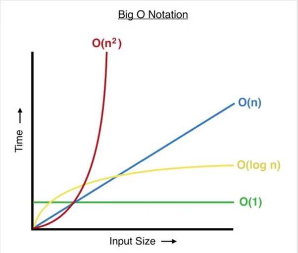
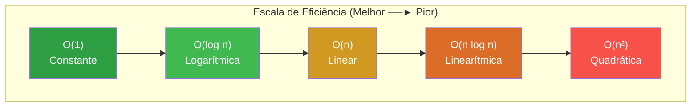

# Guia de Estruturas de Dados, Ponteiros e Algoritmos em C

Este guia  aborda o agrupamento de estrutura de dados, gerenciamento de memória de baixo nível, análise de algoritmos e as estruturas de dados clássicas essenciais para o desenvolvimento de sistemas robustos e eficientes em C.

---
## 1 Agrupamento de Dados com Registros (Structs)

### 1.1 Definição e Estrutura Física na Memória
Uma estrutura (**`struct`**) agrupa diversas variáveis de tipos de dados potencialmente distintos sob um único rótulo lógico, alocando-as em um **bloco contíguo de memória física**.

*   **Alinhamento de Memória (*Padding*):** O compilador frequentemente adiciona bytes vazios de preenchimento (*padding*) entre os membros da estrutura para alinhar os dados aos limites físicos da arquitetura do processador (comumente limites de 4 ou 8 bytes), visando otimizar a velocidade de acesso de hardware. Para minimizar o consumo de memória, é uma prática recomendada de engenharia **ordenar os campos da estrutura do tipo de maior tamanho para o menor**.
*   **Tamanho do Bloco:** O tamanho total de uma `struct` é calculado por meio do operador `sizeof(struct Nome)` e é maior ou igual à soma das larguras físicas individuais de seus campos.
*   **Inicialização Posicional vs. Inicialização Designada:** O C moderno permite inicializar os membros em ordem estrita de declaração ou associá-los diretamente pelo nome de seus campos utilizando o operador ponto `.`.

| Método de Inicialização | Mecânica de Execução | Exemplo Prático |
| :--- | :--- | :--- |
| **Posicional (Clássico)** | Inicializa os valores de acordo com a ordem exata com que os membros foram declarados na estrutura. | `struct Aluno a = { "Alice", 123, 8.5f };` |
| **Designada (C99 / C23)** | Permite definir valores para campos específicos e fora de ordem usando a notação `.membro = valor`. Os campos omitidos são zerados automaticamente. | `struct Aluno a = { .id = 123, .gpa = 8.5f };` |

### Sintaxe de Declaração e Acesso
```c
#include <stdio.h>

// Definição do registro
struct Aluno {
    const char *nome;  // Ponteiro para string literal constante
    unsigned int id;
    float gpa;
};

int main(void) {
    // Inicialização designada (membros omitidos são zerados automaticamente)
    struct Aluno bob = {
        .nome = "Bob",
        .id = 202604,
        .gpa = 9.2f
    };

    // Acesso direto aos dados via operador ponto "."
    printf("Aluno: %s | ID: %u | GPA: %.1f\n", bob.nome, bob.id, bob.gpa);
    return 0;
}
```

---
## 2 Ponteiros de Memória e Manipulação de Arquivos

### 2.1 Fundamentos e Operações de Ponteiros
Um **ponteiro** é uma variável cujo conteúdo é um endereço de memória física que aponta para onde outra variável está armazenada.

*   **Operador de Endereço (`&`):** Extrai a coordenada física (endereço) de uma variável na memória RAM.
*   **Operador de Desreferência (`*`):** Acessa e permite alterar diretamente o valor que reside no endereço apontado.
*   **Ponteiro Nulo (`NULL`):** Um ponteiro configurado de forma explícita para o endereço `0`. Serve como uma flag de segurança para indicar que ele não aponta para nenhuma posição válida. **Um ponteiro `NULL` jamais deve ser desreferenciado**, pois tentar fazê-lo gera uma falha de segmentação (*Segmentation Fault*).

```c
int x = 10;
int *p = &x; // 'p' guarda o endereço de 'x'
*p = 20;     // Desreferencia 'p' para alterar 'x' diretamente na memória
```

---

### 2.2 Manipulação de Arquivos via Fluxos de Dados
C realiza a manipulação de arquivos por meio de canais de comunicação lógica estruturados pelo tipo de dado abstrato **`FILE*`** (definido no cabeçalho `<stdio.h>`).

| Modo de Abertura | Descrição do Fluxo | Comportamento se o Arquivo Existir | Comportamento se NÃO Existir |
| :---: | :--- | :--- | :--- |
| **`"r"`** | Somente Leitura. | Abre para leitura no início do arquivo. | Retorna um ponteiro **`NULL`**. |
| **`"w"`** | Somente Escrita. | Descarta todo o conteúdo existente do arquivo. | Cria um novo arquivo. |
| **`"a"`** | Escrita via Anexação. | Abre para escrita mantendo os dados; grava no fim. | Cria um novo arquivo. |
| **`"r+"`** | Leitura e Escrita. | Abre para leitura e escrita a partir do início. | Retorna um ponteiro **`NULL`**. |
| **`"w+"`** | Leitura e Escrita. | Limpa e descarta todo o conteúdo existente. | Cria um novo arquivo. |
| **`"a+"`** | Leitura e Anexação. | Abre para leitura em qualquer ponto e escrita no fim. | Cria um novo arquivo. |

### Sintaxe de Gravação e Leitura Segura de Arquivos
```c
#include <stdio.h>
#include <stdlib.h>

int main(void) {
    // 1. Abertura segura para escrita ("w")
    FILE *fout = fopen("dados.txt", "w");
    if (fout == NULL) { // Tratamento preventivo de falha de sistema
        perror("Erro ao abrir arquivo para escrita");
        return EXIT_FAILURE;
    }

    // Grava dados estruturados no arquivo
    fprintf(fout, "%d %s\n", 2026, "C_Language");
    fclose(fout); // Libera o buffer e fecha o arquivo

    // 2. Abertura segura para leitura ("r")
    FILE *fin = fopen("dados.txt", "r");
    if (fin == NULL) {
        perror("Erro ao abrir arquivo para leitura");
        return EXIT_FAILURE;
    }

    int ano;
    char linguagem[50]; // Buffer para armazenar a string lida
    
    // Realiza leitura formatada buscando dados estruturados do arquivo de forma segura
    if (fscanf(fin, "%d %49s", &ano, linguagem) == 2) {
        printf("Lido com sucesso: %d - %s\n", ano, linguagem);
    }

    fclose(fin); // Fecha o canal de entrada
    return EXIT_SUCCESS;
}
```

---

## 3 Introdução à Complexidade de Algoritmos (Notação Big-O)

### 3.1 Conceitos de Complexidade Lógica
A análise de complexidade quantifica o crescimento de um algoritmo em termos de **tempo de execução** (passos lógicos) e **espaço em memória** (variáveis alocadas) à medida que o tamanho da entrada de dados $n$ cresce para o infinito.

### Notações de Casos Lógicos
1.  **Melhor Caso (Best Case / Notação $\Omega$):** A quantidade mínima de operações lógicas necessárias para a execução completa. Representa o cenário ideal (ex: achar o elemento na primeira posição da busca).
2.  **Caso Médio (Average Case / Notação $\Theta$):** O comportamento estatístico esperado em cenários reais, considerando distribuições probabilísticas equilibradas das entradas de dados.
3.  **Pior Caso (Worst Case / Notação $O$ - Big-O):** Representa o limite máximo de tempo ou espaço que o algoritmo demandará no cenário mais desfavorável. É a métrica mais crucial no desenvolvimento de sistemas, pois oferece uma garantia matemática de limite superior.

| Classe de Complexidade | Notação Big-O | Comportamento do Algoritmo                                                          | Exemplo Prático                                         |
| :--------------------- | :-----------: | :---------------------------------------------------------------------------------- | :------------------------------------------------------ |
| **Constante**          |    $O(1)$     | O tempo de execução permanece o mesmo, indiferente ao tamanho de $n$.               | Acesso direto a um índice de vetor.                     |
| **Logarítmica**        |  $O(\log n)$  | O problema é dividido pela metade a cada passo executado.                           | Algoritmo de Busca Binária.                             |
| **Linear**             |    $O(n)$     | O tempo de execução cresce de forma diretamente proporcional ao tamanho de $n$.     | Algoritmo de Busca Linear.                              |
| **Linearítmica**       | $O(n \log n)$ | Divisão de problemas combinada com percursos lineares sequenciais.                  | Algoritmos eficientes como *Merge Sort* e *Quick Sort*. |
| **Quadrática**         |   $O(n^2)$    | Loops aninhados que percorrem a totalidade da coleção para cada elemento existente. | Algoritmos de ordenação simples como *Bubble Sort*.     |




---

## 4 Lógica de Algoritmos de Busca e Ordenação

### 4.1 Algoritmos de Busca
Servem para inspecionar coleções de dados em busca de um elemento específico.

#### 1. Busca Linear (Varredura Sequencial)
Inspeciona cada posição da coleção, do índice `0` até o limite máximo `N - 1`, um a um.
*   **Pré-requisito:** Nenhum (funciona em dados desordenados).
*   **Complexidade:** Pior Caso: $O(n)$ | Melhor Caso: $O(1)$.

#### 2. Busca Binária
Divide o espaço de busca na metade a cada comparação condicional. O algoritmo compara o alvo com o valor posicionado no índice central da coleção ordenada.
*   **Pré-requisito:** Os dados devem estar **rigorosamente ordenados**.
*   **Complexidade:** Pior Caso: $O(\log n)$ | Melhor Caso: $O(1)$.

### Sintaxe de Implementação da Busca Binária em C
```c
#include <stdio.h>

// Algoritmo de Busca Binária Eficiente
int binary_search(const int arr[], int tamanho, int alvo) {
    int esquerda = 0;
    int direita = tamanho - 1;

    while (esquerda <= direita) {
        int meio = esquerda + (direita - esquerda) / 2; // Evita estouro aritmético de inteiros

        if (arr[meio] == alvo) {
            return meio; // Elemento localizado: retorna seu índice
        }
        if (arr[meio] < alvo) {
            esquerda = meio + 1; // Alvo está na metade direita
        } else {
            direita = meio - 1;  // Alvo está na metade esquerda
        }
    }
    return -1; // Elemento não existente na coleção
}
```

---

### 4.2 Algoritmos de Ordenação
Reorganizam a posição física dos dados dentro de um vetor para satisfazer uma ordem linear (crescente ou decrescente).

| Algoritmo          | Complexidade (Pior) | Complexidade (Melhor) | Mecânica Física de Funcionamento                                                                                         |
| :----------------- | :-----------------: | :-------------------: | :----------------------------------------------------------------------------------------------------------------------- |
| **Bubble Sort**    |      $O(n^2)$       |   $O(n)$ (com flag)   | Varre o vetor comparando valores adjacentes e efetuando trocas (*swaps*) de modo a empurrar o maior dado para o fim.     |
| **Selection Sort** |      $O(n^2)$       |       $O(n^2)$        | Varre o vetor localizando o menor elemento geral da sub-lista desordenada e o posiciona no início.                       |
| **Insertion Sort** |      $O(n^2)$       |        $O(n)$         | Percorre o vetor inserindo cada elemento em sua posição correta dentro de uma sub-lista que já foi previamente ordenada. |

### Sintaxe de Implementação: Bubble Sort em C
```c
#include <stdio.h>

void bubble_sort(int arr[], int tamanho) {
    int houve_troca;

    for (int i = 0; i < tamanho - 1; i++) {
        houve_troca = 0; // Flag para monitorar transição de estado e otimizar se ordenado

        for (int j = 0; j < tamanho - i - 1; j++) {
            if (arr[j] > arr[j + 1]) {
                // Efetua a troca física de valores na memória (swap)
                int temp = arr[j];
                arr[j] = arr[j + 1];
                arr[j + 1] = temp;
                houve_troca = 1; // Registra ocorrência de troca
            }
        }
        if (!houve_troca) { // Se nenhuma troca ocorreu, o vetor já está ordenado
            break; // Otimização do Melhor Caso O(n)
        }
    }
}
```

---

## 5 Estruturas de Dados Dinâmicas: Pilhas, Filas e Listas

Estas estruturas são formadas por blocos dinâmicos chamados de **Nós** (*Nodes*), que contêm os dados e apontadores (ponteiros) para associar logicamente a coleção.

| Estrutura de Dados  | Acesso / Busca | Inserção (Inserir Dado) | Remoção (Retirar Dado) | Tipo de Alocação de Memória |
| :--- | :---: | :---: | :---: | :--- |
| **Pilha (LIFO)** | $O(n)$ | $O(1)$ (Sempre no Topo) | $O(1)$ (Sempre do Topo) | Dinâmica (Heap). |
| **Fila (FIFO)** | $O(n)$ | $O(1)$ (Sempre no Final) | $O(1)$ (Sempre no Início) | Dinâmica (Heap). |
| **Lista Encadeada** | $O(n)$ | $O(1)$ (Início) / $O(n)$ (Fim) | $O(1)$ (Início) / $O(n)$ (Valor) | Dinâmica (Heap via `malloc` por nó). |

---

### 1. Pilha Dinâmica (*Stack*)

Estrutura de dados que opera sob a política estrita **LIFO (Last In, First Out)**: o último elemento inserido é obrigatoriamente o primeiro a ser removido.

*   **Operações Essenciais:**
    *   `Push`: Aloca um novo nó e o empilha no topo ($O(1)$).
    *   `Pop`: Desempilha, remove e retorna o elemento do topo, liberando sua memória ($O(1)$).
    *   `Peek` (ou `Top`): Consulta o valor armazenado no topo sem removê-lo ($O(1)$).
    *   `IsEmpty`: Avalia se o ponteiro de topo é `NULL` ($O(1)$).
    *   `Liberar (Free)`: Desaloca sequencialmente todos os nós para evitar vazamentos de memória (*memory leaks*) ($O(n)$).

#### Sintaxe de Implementação: Pilha em C
```c
#include <stdio.h>
#include <stdlib.h>
#include <stdbool.h>

// Definição do Nó da Pilha
typedef struct No {
    int dado;
    struct No *proximo; // Aponta para o elemento logo abaixo na pilha
} No;

// Verifica se a pilha está vazia
bool is_empty(const No *topo) {
    return (topo == NULL);
}

// Insere elemento no topo da pilha (Push)
void push(No **topo, int valor) {
    No *novo = malloc(sizeof(No));
    if (novo == NULL) {
        perror("Falha de alocação para push");
        exit(EXIT_FAILURE);
    }
    novo->dado = valor;
    novo->proximo = *topo; // O novo nó aponta para o topo anterior
    *topo = novo;          // Atualiza o topo para o novo nó
}

// Remove e retorna o elemento do topo da pilha (Pop)
int pop(No **topo) {
    if (is_empty(*topo)) {
        fprintf(stderr, "Erro: Pilha vazia (Stack Underflow)!\n");
        exit(EXIT_FAILURE);
    }
    No *temp = *topo;
    int valor = temp->dado;
    *topo = (*topo)->proximo; // Avança o topo para o nó inferior
    free(temp);               // Libera a memória do nó desempilhado
    return valor;
}

// Consulta o elemento do topo sem remover (Peek)
int peek(const No *topo) {
    if (is_empty(topo)) {
        fprintf(stderr, "Erro: Pilha vazia ao consultar topo!\n");
        exit(EXIT_FAILURE);
    }
    return topo->dado;
}

// Desaloca todos os nós da pilha
void free_stack(No **topo) {
    No *atual = *topo;
    while (atual != NULL) {
        No *proximo = atual->proximo;
        free(atual);
        atual = proximo;
    }
    *topo = NULL;
}

int main(void) {
    No *pilha = NULL; // Inicialização da pilha vazia

    push(&pilha, 10);
    push(&pilha, 20);
    push(&pilha, 30);

    printf("Elemento no topo (peek): %d\n", peek(pilha)); // 30
    printf("Desempilhado (pop): %d\n", pop(&pilha));       // 30
    printf("Novo topo após pop: %d\n", peek(pilha));       // 20

    free_stack(&pilha);
    return 0;
}
```

---

### 2. Fila Dinâmica (*Queue*)

Estrutura de dados linear que opera sob a política **FIFO (First In, First Out)**: o primeiro elemento inserido é obrigatoriamente o primeiro a ser processado e removido (como uma fila de atendimento).

*   **Ponteiros de Controle:** Utiliza dois ponteiros na estrutura descritora para garantir complexidade $O(1)$ em ambas as pontas:
    *   `inicio` (*Front*): Aponta para o primeiro elemento (onde ocorrem as remoções).
    *   `fim` (*Rear*): Aponta para o último elemento (onde ocorrem as inserções).
*   **Operações Essenciais:**
    *   `Enqueue`: Insere um novo elemento no fim da fila ($O(1)$).
    *   `Dequeue`: Remove e retorna o elemento do início, avançando o ponteiro `inicio` ($O(1)$).
    *   `Front` (ou `Peek`): Consulta o elemento da frente sem removê-lo ($O(1)$).
    *   `IsEmpty`: Avalia se `inicio == NULL` ($O(1)$).
    *   `Liberar (Free)`: Desaloca todos os nós dinâmicos e a estrutura descritora da fila ($O(n)$).

#### Sintaxe de Implementação: Fila em C
```c
#include <stdio.h>
#include <stdlib.h>
#include <stdbool.h>

// Nó individual da fila
typedef struct No {
    int dado;
    struct No *proximo;
} No;

// Estrutura descritora da fila com ponteiros de início e fim
typedef struct Fila {
    No *inicio;
    No *fim;
} Fila;

// Cria e inicializa uma fila vazia
Fila* create_queue(void) {
    Fila *f = malloc(sizeof(Fila));
    if (f == NULL) {
        perror("Falha ao alocar descritor da fila");
        exit(EXIT_FAILURE);
    }
    f->inicio = NULL;
    f->fim = NULL;
    return f;
}

// Verifica se a fila está vazia
bool is_empty(const Fila *f) {
    return (f == NULL || f->inicio == NULL);
}

// Insere elemento no fim da fila (Enqueue)
void enqueue(Fila *f, int valor) {
    No *novo = malloc(sizeof(No));
    if (novo == NULL) {
        perror("Falha ao alocar nó da fila");
        exit(EXIT_FAILURE);
    }
    novo->dado = valor;
    novo->proximo = NULL;

    if (is_empty(f)) {
        f->inicio = novo;
        f->fim = novo;
    } else {
        f->fim->proximo = novo; // O último elemento aponta para o novo nó
        f->fim = novo;          // Atualiza o ponteiro de fim da fila
    }
}

// Remove e retorna o elemento do início da fila (Dequeue)
int dequeue(Fila *f) {
    if (is_empty(f)) {
        fprintf(stderr, "Erro: Fila vazia (Queue Underflow)!\n");
        exit(EXIT_FAILURE);
    }
    No *temp = f->inicio;
    int valor = temp->dado;

    f->inicio = f->inicio->proximo;
    if (f->inicio == NULL) {
        f->fim = NULL; // Se a fila esvaziou, o fim também volta a ser NULL
    }

    free(temp);
    return valor;
}

// Consulta o elemento da frente da fila
int front(const Fila *f) {
    if (is_empty(f)) {
        fprintf(stderr, "Erro: Fila vazia ao consultar frente!\n");
        exit(EXIT_FAILURE);
    }
    return f->inicio->dado;
}

// Desaloca todos os nós e a estrutura da fila
void free_queue(Fila *f) {
    if (f == NULL) return;
    No *atual = f->inicio;
    while (atual != NULL) {
        No *proximo = atual->proximo;
        free(atual);
        atual = proximo;
    }
    free(f);
}

int main(void) {
    Fila *fila = create_queue();

    enqueue(fila, 100);
    enqueue(fila, 200);
    enqueue(fila, 300);

    printf("Frente da fila: %d\n", front(fila));            // 100
    printf("Desenfileirado (dequeue): %d\n", dequeue(fila)); // 100
    printf("Nova frente após dequeue: %d\n", front(fila));  // 200

    free_queue(fila);
    return 0;
}
```

---

### 3. Lista Encadeada Simples (*Singly Linked List*)

Coleção dinâmica linear onde cada nó armazena seu dado e o endereço físico (`proximo`) do nó subsequente no Heap. Ao contrário dos vetores (*arrays*), não exige blocos de memória física contígua nem tamanho pré-fixado.

*   **Operações Essenciais:**
    *   `Inserir no Início`: Conecta o novo nó à cabeça atual e redefine a cabeça ($O(1)$).
    *   `Inserir no Fim`: Percorre a lista até o último nó (`proximo == NULL`) e anexa o novo elemento ($O(n)$).
    *   `Remover por Valor`: Localiza o valor encadeado, religa o ponteiro do nó anterior diretamente ao seguinte e desaloca o nó alvo ($O(n)$).
    *   `Buscar`: Varre sequencialmente os nós até encontrar o elemento procurado ou atingir `NULL` ($O(n)$).
    *   `Imprimir/Percorrer`: Itera por todos os nós para visualização ($O(n)$).
    *   `Liberar (Free)`: Percorre e desaloca cada nó alocado no Heap ($O(n)$).

#### Sintaxe de Implementação: Lista Encadeada em C
```c
#include <stdio.h>
#include <stdlib.h>
#include <stdbool.h>

// Definição do Nó da Lista Encadeada
typedef struct No {
    int dado;
    struct No *proximo; // Aponta para o próximo nó da lista ou NULL
} No;

// Insere um novo nó no início da lista (O(1))
void insert_front(No **cabeca, int valor) {
    No *novo = malloc(sizeof(No));
    if (novo == NULL) {
        perror("Falha ao alocar nó");
        exit(EXIT_FAILURE);
    }
    novo->dado = valor;
    novo->proximo = *cabeca;
    *cabeca = novo;
}

// Insere um novo nó no fim da lista (O(n))
void insert_end(No **cabeca, int valor) {
    No *novo = malloc(sizeof(No));
    if (novo == NULL) {
        perror("Falha ao alocar nó");
        exit(EXIT_FAILURE);
    }
    novo->dado = valor;
    novo->proximo = NULL;

    if (*cabeca == NULL) {
        *cabeca = novo;
        return;
    }

    No *atual = *cabeca;
    while (atual->proximo != NULL) {
        atual = atual->proximo; // Percorre até encontrar o nó final
    }
    atual->proximo = novo;
}

// Remove a primeira ocorrência do valor na lista (O(n))
bool remove_value(No **cabeca, int valor) {
    if (*cabeca == NULL) return false;

    No *temp = *cabeca;

    // Caso o elemento a ser removido seja a própria cabeça
    if (temp->dado == valor) {
        *cabeca = temp->proximo;
        free(temp);
        return true;
    }

    // Busca pelo nó anterior ao elemento desejado
    No *anterior = NULL;
    while (temp != NULL && temp->dado != valor) {
        anterior = temp;
        temp = temp->proximo;
    }

    if (temp == NULL) return false; // Valor não encontrado

    anterior->proximo = temp->proximo; // Religa contornando o nó removido
    free(temp);
    return true;
}

// Percorre e exibe os nós da lista encadeada
void print_list(const No *cabeca) {
    const No *atual = cabeca;
    printf("Lista: ");
    while (atual != NULL) {
        printf("%d -> ", atual->dado);
        atual = atual->proximo;
    }
    printf("NULL\n");
}

// Desaloca todos os nós da lista encadeada da memória
void free_list(No **cabeca) {
    No *atual = *cabeca;
    while (atual != NULL) {
        No *proximo = atual->proximo;
        free(atual);
        atual = proximo;
    }
    *cabeca = NULL;
}

int main(void) {
    No *lista = NULL; // Lista inicialmente vazia

    insert_front(&lista, 20);
    insert_front(&lista, 10);
    insert_end(&lista, 30);
    insert_end(&lista, 40);

    print_list(lista); // Lista: 10 -> 20 -> 30 -> 40 -> NULL

    remove_value(&lista, 20);
    printf("Após remover 20:\n");
    print_list(lista); // Lista: 10 -> 30 -> 40 -> NULL

    free_list(&lista);
    return 0;
}
```

<div class="chapter-nav">
  <div class="chapter-nav-prev">[[01-logica-fundamentos/README|← 01. Lógica de Programação]]</div>
  <a href="#" class="chapter-nav-top">↑ De volta ao topo</a>
  <div class="chapter-nav-next">[[03-estruturas-de-dados-2/README|03. Estruturas de dados 2 →]]</div>
</div>
