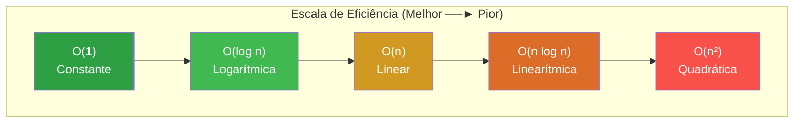

# Guia de Estruturas de Dados, Ponteiros e Algoritmos em C

Este guia  aborda o agrupamento de estrutura de dados, gerenciamento de memória de baixo nível, análise de algoritmos e as estruturas de dados clássicas essenciais para o desenvolvimento de sistemas robustos e eficientes em C.

---
## 1 - Agrupamento de Dados com Registros (Structs)

### Definição e Estrutura Física na Memória
Uma estrutura (**`struct`**) agrupa diversas variáveis de tipos de dados potencialmente distintos sob um único rótulo lógico, alocando-as em um **bloco contíguo de memória física**.

*   **Alinhamento de Memória (*Padding*):** O compilador frequentemente adiciona bytes vazios de preenchimento (*padding*) entre os membros da estrutura para alinhar os dados aos limites físicos da arquitetura do processador (comumente limites de 4 ou 8 bytes), visando otimizar a velocidade de acesso de hardware. Para minimizar o consumo de memória, é uma prática recomendada de engenharia **ordenar os campos da estrutura do tipo de maior tamanho para o menor**.
*   **Tamanho do Bloco:** O tamanho total de uma `struct` é calculado por meio do operador `sizeof(struct Nome)` e é maior ou igual à soma das larguras físicas individuais de seus campos.
*   **Inicialização Posicional vs. Inicialização Designada:** O C moderno permite inicializar os membros em ordem estrita de declaração ou associá-los diretamente pelo nome de seus campos utilizando o operador ponto `.`.

| Método de Inicialização | Mecânica de Execução | Exemplo Prático |
| :--- | :--- | :--- |
| **Posicional (Clássico)** | Inicializa os valores de acordo com a ordem exata com que os membros foram declarados na estrutura. | `struct Aluno a = { "Alice", 123, 8.5f };` |
| **Designada (C99 / C23)** | Permite definir valores para campos específicos e fora de ordem usando a notação `.membro = valor`. Os campos omitidos são zerados automaticamente. | `struct Aluno a = { .id = 123, .gpa = 8.5f };` |

### Sintaxe de Declaração e Acesso
```c
#include <stdio.h>

// Definição do registro
struct Aluno {
    const char *nome;  // Ponteiro para string literal constante
    unsigned int id;
    float gpa;
};

int main(void) {
    // Inicialização designada (membros omitidos são zerados automaticamente)
    struct Aluno bob = {
        .nome = "Bob",
        .id = 202604,
        .gpa = 9.2f
    };

    // Acesso direto aos dados via operador ponto "."
    printf("Aluno: %s | ID: %u | GPA: %.1f\n", bob.nome, bob.id, bob.gpa);
    return 0;
}
```

---
## 2 - Ponteiros de Memória e Manipulação de Arquivos

### Fundamentos e Operações de Ponteiros
Um **ponteiro** é uma variável cujo conteúdo é um endereço de memória física que aponta para onde outra variável está armazenada.

*   **Operador de Endereço (`&`):** Extrai a coordenada física (endereço) de uma variável na memória RAM.
*   **Operador de Desreferência (`*`):** Acessa e permite alterar diretamente o valor que reside no endereço apontado.
*   **Ponteiro Nulo (`NULL`):** Um ponteiro configurado de forma explícita para o endereço `0`. Serve como uma flag de segurança para indicar que ele não aponta para nenhuma posição válida. **Um ponteiro `NULL` jamais deve ser desreferenciado**, pois tentar fazê-lo gera uma falha de segmentação (*Segmentation Fault*).

```c
int x = 10;
int *p = &x; // 'p' guarda o endereço de 'x'
*p = 20;     // Desreferencia 'p' para alterar 'x' diretamente na memória
```

---

### Manipulação de Arquivos via Fluxos de Dados
C realiza a manipulação de arquivos por meio de canais de comunicação lógica estruturados pelo tipo de dado abstrato **`FILE*`** (definido no cabeçalho `<stdio.h>`).

| Modo de Abertura | Descrição do Fluxo | Comportamento se o Arquivo Existir | Comportamento se NÃO Existir |
| :---: | :--- | :--- | :--- |
| **`"r"`** | Somente Leitura. | Abre para leitura no início do arquivo. | Retorna um ponteiro **`NULL`**. |
| **`"w"`** | Somente Escrita. | Descarta todo o conteúdo existente do arquivo. | Cria um novo arquivo. |
| **`"a"`** | Escrita via Anexação. | Abre para escrita mantendo os dados; grava no fim. | Cria um novo arquivo. |
| **`"r+"`** | Leitura e Escrita. | Abre para leitura e escrita a partir do início. | Retorna um ponteiro **`NULL`**. |
| **`"w+"`** | Leitura e Escrita. | Limpa e descarta todo o conteúdo existente. | Cria um novo arquivo. |
| **`"a+"`** | Leitura e Anexação. | Abre para leitura em qualquer ponto e escrita no fim. | Cria um novo arquivo. |

### Sintaxe de Gravação e Leitura Segura de Arquivos
```c
#include <stdio.h>
#include <stdlib.h>

int main(void) {
    // 1. Abertura segura para escrita ("w")
    FILE *fout = fopen("dados.txt", "w");
    if (fout == NULL) { // Tratamento preventivo de falha de sistema
        perror("Erro ao abrir arquivo para escrita");
        return EXIT_FAILURE;
    }

    // Grava dados estruturados no arquivo
    fprintf(fout, "%d %s\n", 2026, "C_Language");
    fclose(fout); // Libera o buffer e fecha o arquivo

    // 2. Abertura segura para leitura ("r")
    FILE *fin = fopen("dados.txt", "r");
    if (fin == NULL) {
        perror("Erro ao abrir arquivo para leitura");
        return EXIT_FAILURE;
    }

    int ano;
    char linguagem[50]; // Buffer para armazenar a string lida
    
    // Realiza leitura formatada buscando dados estruturados do arquivo de forma segura
    if (fscanf(fin, "%d %49s", &ano, linguagem) == 2) {
        printf("Lido com sucesso: %d - %s\n", ano, linguagem);
    }

    fclose(fin); // Fecha o canal de entrada
    return EXIT_SUCCESS;
}
```

---

## 3 - Introdução à Complexidade de Algoritmos (Notação Big-O)

### Conceitos de Complexidade Lógica
A análise de complexidade quantifica o crescimento de um algoritmo em termos de **tempo de execução** (passos lógicos) e **espaço em memória** (variáveis alocadas) à medida que o tamanho da entrada de dados $n$ cresce para o infinito.

### Notações de Casos Lógicos
1.  **Melhor Caso (Best Case / Notação $\Omega$:** A quantidade mínima de operações lógicas necessárias para a execução completa. Representa o cenário ideal (ex: achar o elemento na primeira posição da busca).
2.  **Caso Médio (Average Case / Notação $\Theta$:** O comportamento estatístico esperado em cenários reais, considerando distribuições probabilísticas equilibradas das entradas de dados.
3.  **Pior Caso (Worst Case / Notação $O$ - Big-O):** Representa o limite máximo de tempo ou espaço que o algoritmo demandará no cenário mais desfavorável. É a métrica mais crucial no desenvolvimento de sistemas, pois oferece uma garantia matemática de limite superior.

| Classe de Complexidade | Notação Big-O | Comportamento do Algoritmo                                                          | Exemplo Prático                                         |
| :--------------------- | :-----------: | :---------------------------------------------------------------------------------- | :------------------------------------------------------ |
| **Constante**          |    $(O(1)$    | O tempo de execução permanece o mesmo, indiferente ao tamanho de \\(n\\).           | Acesso direto a um índice de vetor.                     |
| **Logarítmica**        |  $O(\log n)$  | O problema é dividido pela metade a cada passo executado.                           | Algoritmo de Busca Binária.                             |
| **Linear**             |    $O(n)$     | O tempo de execução cresce de forma diretamente proporcional ao tamanho de \\(n\\). | Algoritmo de Busca Linear.                              |
| **Linearítmica**       | $O(n \log n)$ | Divisão de problemas combinada com percursos lineares sequenciais.                  | Algoritmos eficientes como *Merge Sort* e *Quick Sort*. |
| **Quadrática**         |   $O(n^2)$    | Loops aninhados que percorrem a totalidade da coleção para cada elemento existente. | Algoritmos de ordenação simples como *Bubble Sort*.     |
![[complexidade_algoritmos.png|338]]


---

## 4 - Lógica de Algoritmos de Busca e Ordenação

### Algoritmos de Busca
Servem para inspecionar coleções de dados em busca de um elemento específico.

#### 1. Busca Linear (Varredura Sequencial)
Inspeciona cada posição da coleção, do índice `0` até o limite máximo `N - 1`, um a um.
*   **Pré-requisito:** Nenhum (funciona em dados desordenados).
*   **Complexidade:** Pior Caso: $O(n)$ | Melhor Caso: $O(1)$.

#### 2. Busca Binária
Divide o espaço de busca na metade a cada comparação condicional. O algoritmo compara o alvo com o valor posicionado no índice central da coleção ordenada.
*   **Pré-requisito:** Os dados devem estar **rigorosamente ordenados**.
*   **Complexidade:** Pior Caso: $O(\log n)$ | Melhor Caso: $O(1)$.

### Sintaxe de Implementação da Busca Binária em C
```c
#include <stdio.h>

// Algoritmo de Busca Binária Eficiente
int busca_binaria(const int arr[], int tamanho, int alvo) {
    int esquerda = 0;
    int direita = tamanho - 1;

    while (esquerda <= direita) {
        int meio = esquerda + (direita - esquerda) / 2; // Evita estouro aritmético de inteiros

        if (arr[meio] == alvo) {
            return meio; // Elemento localizado: retorna seu índice
        }
        if (arr[meio] < alvo) {
            esquerda = meio + 1; // Alvo está na metade direita
        } else {
            direita = meio - 1;  // Alvo está na metade esquerda
        }
    }
    return -1; // Elemento não existente na coleção
}
```

---

### Algoritmos de Ordenação
Reorganizam a posição física dos dados dentro de um vetor para satisfazer uma ordem linear (crescente ou decrescente).

| Algoritmo          | Complexidade (Pior) | Complexidade (Melhor) | Mecânica Física de Funcionamento                                                                                         |
| :----------------- | :-----------------: | :-------------------: | :----------------------------------------------------------------------------------------------------------------------- |
| **Bubble Sort**    |      $(O(n^2)$      |   $O(n)$ (com flag)   | Varre o vetor comparando valores adjacentes e efetuando trocas (*swaps*) de modo a empurrar o maior dado para o fim.     |
| **Selection Sort** |      $O(n^2)$       |       $O(n^2)$        | Varre o vetor localizando o menor elemento geral da sub-lista desordenada e o posiciona no início.                       |
| **Insertion Sort** |      $O(n^2)$       |        $O(n)$         | Percorre o vetor inserindo cada elemento em sua posição correta dentro de uma sub-lista que já foi previamente ordenada. |

### Sintaxe de Implementação: Bubble Sort em C
```c
#include <stdio.h>

void bubble_sort(int arr[], int tamanho) {
    int houve_troca;

    for (int i = 0; i < tamanho - 1; i++) {
        houve_troca = 0; // Flag para monitorar transição de estado e otimizar se ordenado

        for (int j = 0; j < tamanho - i - 1; j++) {
            if (arr[j] > arr[j + 1]) {
                // Efetua a troca física de valores na memória (swap)
                int temp = arr[j];
                arr[j] = arr[j + 1];
                arr[j + 1] = temp;
                houve_troca = 1; // Registra ocorrência de troca
            }
        }
        if (!houve_troca) { // Se nenhuma troca ocorreu, o vetor já está ordenado
            break; // Otimização do Melhor Caso O(n)
        }
    }
}
```

---

## 5 - Estruturas de Dados Dinâmicas: Pilhas, Filas e Listas

Estas estruturas são formadas por blocos dinâmicos chamados de **Nós**, que contêm os dados e apontadores (ponteiros) para associar logicamente a coleção.

### As Três Estruturas Clássicas

#### 1. Pilha (*Stack*)
Estrutura de dados que opera sob a política **LIFO (Last In, First Out)**. O último elemento a entrar na estrutura deve ser obrigatoriamente o primeiro a sair.
*   **Operações:** `Push` (empilha elemento no topo) e `Pop` (remove e retorna o elemento do topo).

#### 2. Fila (*Queue*)
Estrutura de dados que opera sob a política **FIFO (First In, First Out)**. O primeiro elemento a entrar na estrutura é obrigatoriamente o primeiro a sair (como uma fila bancária real).
*   **Operações:** `Enqueue` (enfileira elemento ao final) e `Dequeue` (remove o elemento do início).

#### 3. Lista Encadeada (*Linked List*)
Coleção linear de elementos alocados de forma espalhada no Heap de memória. Cada nó possui um ponteiro `next` que aponta para o próximo nó do encadeamento lógico, eliminando a exigência de alocação de memória de forma física e contígua.

| Estrutura de Dados  | Acesso / Busca |    Inserção (Inserir Dado)     |     Remoção (Retirar Dado)     | Tipo de Alocação de Memória          |
| :------------------ | :------------: | :----------------------------: | :----------------------------: | :----------------------------------- |
| **Pilha (LIFO)**    |     $O(n)$     |    $O(1)$ (Sempre no Topo)     |    $O(1)$ (Sempre do Topo)     | Dinâmica (Heap).                     |
| **Fila (FIFO)**     |     $O(n)$     |    $O(1)$ (Sempre no Final)    |   $O(1)$ (Sempre no Início)    | Dinâmica (Heap).                     |
| **Lista Encadeada** |     $O(n)$     | $O(1)$ (Se o nó for conhecido) | $O(1)$ (Se o nó for conhecido) | Dinâmica (Heap via `malloc` por nó). |

### Sintaxe de Implementação: Pilha Dinâmica em C
```c
#include <stdio.h>
#include <stdlib.h>

// Definição do Nó da Pilha
typedef struct No {
    int dado;
    struct No *proximo; // Ponteiro autorreferencial para o próximo No da pilha
} No;

// Insere elemento no topo da Pilha (Push)
void push(No **topo, int valor) {
    No *novo = malloc(sizeof(No)); // Alocação dinâmica no Heap
    if (novo == NULL) {
        exit(EXIT_FAILURE); // Falha de falta de memória
    }
    novo->dado = valor;
    novo->proximo = *topo; // O novo No aponta para o antigo No do topo
    *topo = novo;          // O topo passa a ser o novo No
}

// Remove elemento do topo da Pilha (Pop)
int pop(No **topo) {
    if (*topo == NULL) {
        printf("Pilha vazia (Stack Underflow)!\n");
        exit(EXIT_FAILURE);
    }
    No *temp = *topo;         // Salva o No do topo para liberar memória
    int valor = temp->dado;   // Extrai o dado
    *topo = (*topo)->proximo; // Avança o topo para o No inferior
    free(temp);               // Libera a memória no Heap
    return valor;             // Retorna o valor retirado
}
```

---