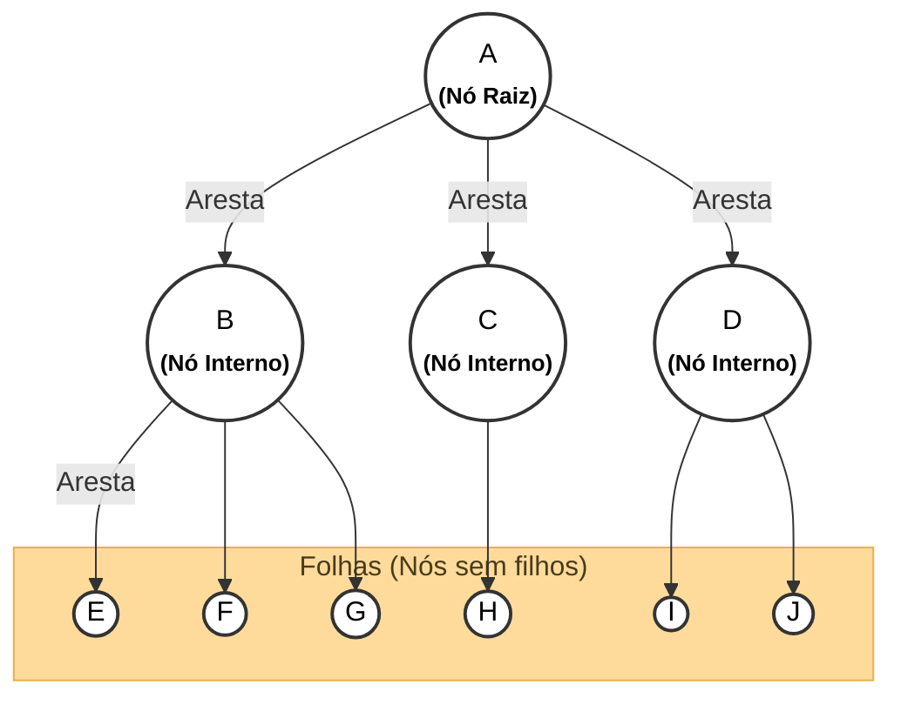
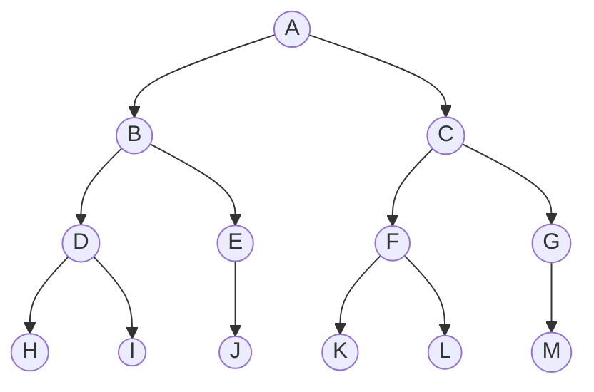
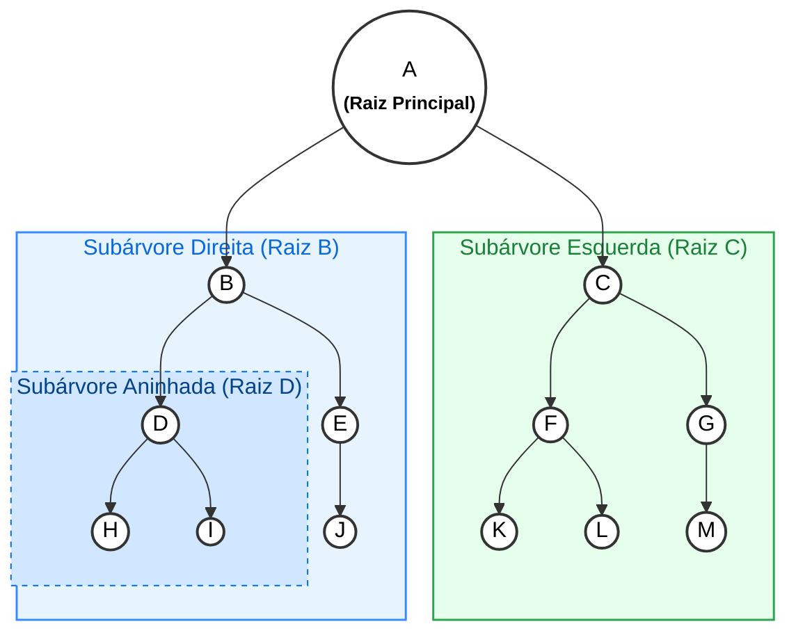
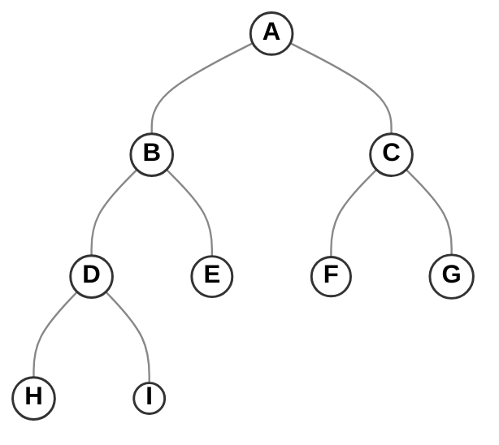
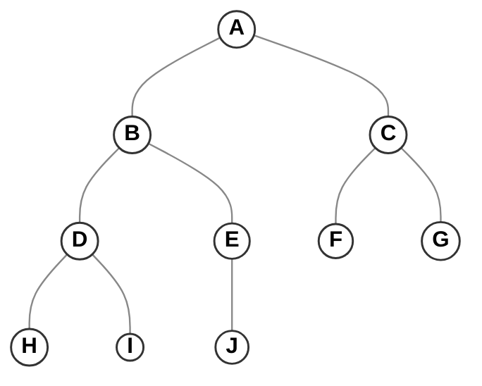
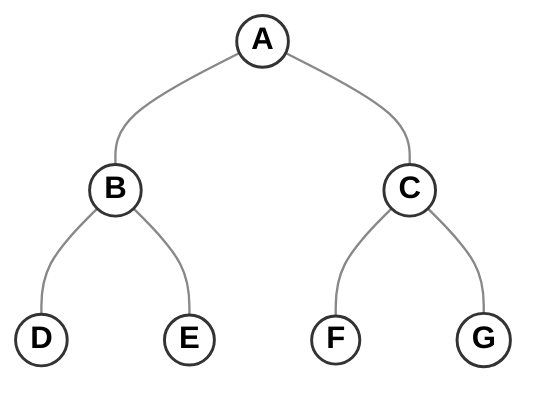
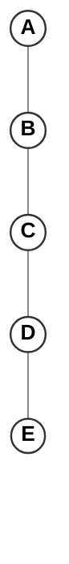
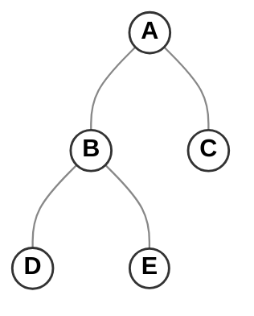

# Guia de Estruturas de Dados, Árvores, Tabela de Dispersão e Grafos em C

## 1 Árvores

Uma árvore é uma estrutura de dados não linear e hierárquica composta por **nós** conectados por **arestas**, ideal para organizar informações que possuem relações de subordinação ou níveis.

### 1.1 Estrutura da árvore
#### 1.1.1 Nó (_Node_)
É a unidade básica de armazenamento da árvore. Cada nó armazena:

2. O **valor/informação** (como um número, caractere ou registro).
3. Os **ponteiros de ligação** que armazenam o endereço de memória de seus nós filhos.

#### 1.1.2 Raiz (_Root Node_)
É o nó de entrada absoluto da hierarquia (no exemplo, o nó **`A`**).

1. **Propriedade exclusiva**: É o **único nó que não possui pai** (nenhuma aresta aponta para ele).
2. Todas as buscas e operações na árvore obrigatoriamente se iniciam a partir do ponteiro da raiz.

####  1.1.3 Arestas (Edges)
São as ligações direcionadas (as setas) que conectam um nó pai ao seu respectivo nó filho.

1. **Fisicamente em C**: Representam um ponteiro guardado dentro da `struct` do pai apontando para o filho.
#### 1.1.4 Folhas (_Leaves_)
São os nós situados nas extremidades finais da árvore (no exemplo, **`E`, `F`, `G`, `H`, `I`, `J`**).

1. **Propriedade**: Possuem **grau 0**, ou seja, **não possuem nenhum filho**.
2. **Em C**: Todos os seus ponteiros para filhos apontam estritamente para `NULL`.



### 1.2 Conceitos Importantes

Seja $\Psi$ a árvore a seguir: 



#### 1.2.1 Subárvore
Uma subárvore consiste em uma porção interconectada da árvore, temos por exemplo a subárvore esquerda de `A`, onde a raiz é `B`, e do mesmo modo a subárvore direita de `A`, onde a raiz é  `C`, veja na figura a seguir:


#### 1.2.2 Tamanho
O tamanho de uma árvore é definido pelo quantidade (total) de **nós**. Da árvore $\Psi$, o tamanho dela é 13.
- Raiz: A (1)
- Nós internos: B, C, D, E, F, G (6)
- Folhas: H, I, J, K, L, M (6)
#### 1.2.3 Altura
A altura de um **nó** é a distancia dele até uma folha. 
- A altura de $\Psi$ é 4.
#### 1.2.4 Profundidade
A profundidade de um **nó** corresponde ao comprimento do caminho que vai desse **nó** até a raiz, ou seja, o número de arestas até a raiz. Veja que a profundidade do nó **J** é **3**:

O cálculo é feito contando o número de arestas do nó raiz (**A**) até o nó em questão:

- **Nível 0:** A (profundidade 0)
    
- **Nível 1:** B (1 aresta: A $\to$ B)
    
- **Nível 2:** E (2 arestas: A $\to$ B $\to$ E)
    
- **Nível 3:** J (3 arestas: A $\to$ B $\to$ E $\to$ J)
#### 1.2.4 Grau
O **grau** de um **nó** corresponde a quantidade de filhos.
- Grau de B: **2**
- Grau de E: **1**
- Grau de F: **2**
- Grau de G :**1**

*Se em uma árvore, os **nós** tem no máximo 2 filhos (grau 2), essa árvore é dita **Árvore Binaria.***

## 2 Árvores Binárias
Uma **árvore binária** é aquela em que cada **nó** pode ter, no máximo, dois filhos.

### 2.1 Propriedades
* Uma árvore binária de altura $h$ tem no máximo $2^{h+1} - 1$ nós
* Uma árvore binária com $n$ nós tem uma altura mínima de $\lceil \log_2(n + 1) \rceil - 1$
* Uma árvore binária com $n$ nós tem no máximo $\lceil n / 2 \rceil$ nós terminais

### 2.2 Classificação
Uma árvore é classificada em 4 fatores:
1. Cheia
2. Completa
3. Perfeita
4. Degenerada

#### 2.2.1 Árvore Binária Cheia
Uma **árvore binária cheia** (full binary tree) é aquela em que todo nó possui estritamente **0 ou 2 filhos** (nenhum nó possui apenas 1 filho).


#### 2.2.2 Árvore Binária Completa
Uma **árvore binária completa** (complete binary tree) possui todos os níveis totalmente preenchidos, com exceção possível do último, que deve estar preenchido obrigatoriamente **da esquerda para a direita**, sem lacunas.


#### 2.2.3 Árvore Binária Perfeita
Uma **árvore binária perfeita** (perfect binary tree) é aquela em que todos os nós internos possuem exatamente 2 filhos e **todas as folhas estão no mesmo nível**.


#### 2.2.4 Árvore Binária Degenerada
Uma **árvore binária degenerada** (ou patológica) é aquela em que cada nó interno possui **apenas 1 filho**. Na prática, a árvore perde as vantagens de ramificação e se comporta exatamente como uma **lista encadeada**, resultando em operações de busca com complexidade $O(n)$ no pior caso.


### 2.3 Implementação em C
```c
#include <stdio.h>
#include <stdlib.h>
#include <string.h>

// estrutura do nó
typedef struct node
{
    int data; // dado
    struct node *left; // nó apontando para o filho a esquerda
    struct node *right; // nó apontando para o filho a direita
} Node;

// função para criar um nó
Node *create_node(int key){
    Node *new_node = malloc(sizeof(Node)); // alocando memoria para o nó
    new_node->data = key; // o dado recebe a key
    new_node->left = new_node->right = NULL; // como não tem filhos, os filhos são NULL

    return new_node;
}

int main(){
    Node *root = create_node(30); // raiz

    root->left = create_node(10);        // filho à esquerda da raiz
    root->right = create_node(5);         // filho à direita da raiz
    root->right->left = create_node(1);   // filho à esquerda de 5
    root->right->right = create_node(2);  // filho à direita de 5

    // chamada da função para imprimir a árvore
    printTree(root);

    return 0;
}

// ================================================
// == As funções aqui abaixo não são importantes ==
// ==     são apenas para mostrar as árvores     ==
//=================================================

// calcula quantos níveis a árvore possui
int treeHeight(Node *root) {
    if (root == NULL) return 0;

    int leftHeight = treeHeight(root->left);
    int rightHeight = treeHeight(root->right);

    return 1 + (leftHeight > rightHeight ? leftHeight : rightHeight);
}

// posiciona cada nó e suas arestas dentro da matriz de caracteres
void printTreeRec(Node *root, char **canvas, int width, int x, int y, int offset) {
    if (root == NULL) return;

    char value[32];
    snprintf(value, sizeof(value), "%d", root->data);

    // imprime o nó atual com a indentação do nivel
    int start = x - (int)strlen(value) / 2;
    for (int i = 0; value[i] != '\0' && start + i < width; i++) {
        if (start + i >= 0) canvas[y][start + i] = value[i];
    }

    int nextOffset = offset / 2;
    if (nextOffset < 2) nextOffset = 2;

    // visita a subarvore direita primeiro
    if (root->right != NULL) {
        canvas[y + 1][x + offset / 2] = '\\';
        printTreeRec(root->right, canvas, width, x + offset, y + 2, nextOffset);
    }

    /// visita a subarvore esquerda
    if (root->left != NULL) {
        canvas[y + 1][x - offset / 2] = '/';
        printTreeRec(root->left, canvas, width, x - offset, y + 2, nextOffset);
    }
}

void printTree(Node *root) {
    if (root == NULL) return;

    int height = treeHeight(root);
    int width = 1 << (height + 2);
    int rows = height * 2 - 1;

    char **canvas = malloc(rows * sizeof(char *));
    for (int i = 0; i < rows; i++) {
        canvas[i] = malloc((width + 1) * sizeof(char));
        memset(canvas[i], ' ', width);
        canvas[i][width] = '\0';
    }

    printTreeRec(root, canvas, width, width / 2, 0, width / 4);

    for (int i = 0; i < rows; i++) {
        int end = width - 1;
        while (end >= 0 && canvas[i][end] == ' ') end--;
        canvas[i][end + 1] = '\0';
        printf("%s\n", canvas[i]);
        free(canvas[i]);
    }
    free(canvas);
}
```

## 2.4 Percursos
Existem dois tipos de percursos:
- Percurso em Largura
- Percurso em Profundidade

#### 2.4.1 Percurso em Largura
O percurso em largura visita os **nós** em cada nível, da esquerda para a direita, antes de prosseguir para o próximo.


Sequencia: A, B, C, D e E
- Nível 0: A
- Nível 1: B e C
- Nível 2: D e E
#### 2.4.2 Percurso em Profundidade
O percurso em profundidade explora três possíveis casos em cada ramo antes de retroceder. Esta categoria inclui os subtipos **pré-ordem**, **ordem** e **pós-ordem**.

##### 1. Pré-ordem
Cada nó é processado antes de seus filhos. 

- **Raiz**
- **Subárvore esquerda**
- **Subárvore direita**


Percursos: **A, B, D, E, C**

##### 2. Ordem
Processa a subárvore esquerda, o nó atual e, em seguida, a subárvore direita.

- **Subárvore esquerda**
- **Raiz (nó atual)**
- **Subárvore direita**


Percurso: **D, B, E, A, C**
##### 3 Pós-Ordem
Acessa o nó atual após suas subárvores.

- **Subárvore esquerda**
- **Subárvore direita**
- **Raiz (nó atual)**

Percurso: **D, E, B, C, A**

##### 2.4.2.1 Implementação em C 

```c
void pre_order(Node *root) {
    if (root != NULL) {
        printf("%d ", root->key);
        pre_order(root->left);
        pre_order(root->right);
    }
}

void in_order(Node *root) {
    if (root != NULL) {
        in_order(root->left);
        printf("%d ", root->key);
        in_order(root->right);
    }
}

void pos_order(Node *root) {
    if (root != NULL) {
        pos_order(root->left);
        pos_order(root->right);
        printf("%d ", root->key);
    }
}
```
